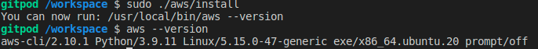
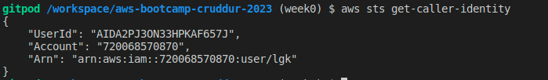
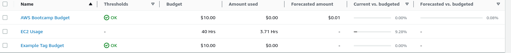
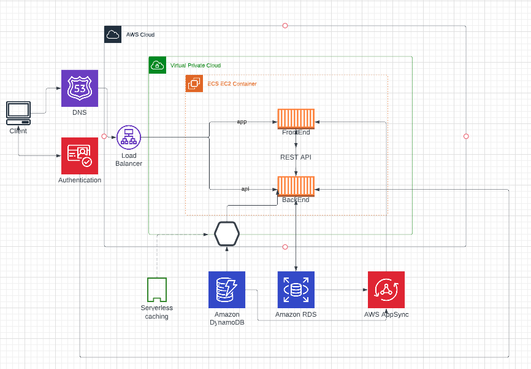

# Week 0 — Billing and Architecture

## Required Homework/Tasks

### Install AWS CLI

Installed the AWS CLI using the steps shared in the gitpod yml file.



### User details
User details accessing from AWS CLI.



### Create a billing alarm for the budget



### Recreate Logical architecture diagram


[Lucid_Charts_Share_link](https://lucid.app/lucidchart/a5691e9c-457f-4e0b-ab29-8e479eac3ca2/edit?viewport_loc=-592%2C-24%2C3328%2C1684%2C0_0&invitationId=inv_ae3b4dd0-fb59-4c57-a39c-9bacc67339dd)

### Example of reference a file in code base.

```json
{
    "BudgetLimit": {
        "Amount": "10",
        "Unit": "USD"
    },
    "BudgetName": "Example Tag Budget",
    "BudgetType": "COST",
    "CostFilters": {
        "TagKeyValue": [
            "user:Key$value1",
            "user:Key$value2"
        ]
    },
    "CostTypes": {
        "IncludeCredit": true,
        "IncludeDiscount": true,
        "IncludeOtherSubscription": true,
        "IncludeRecurring": true,
        "IncludeRefund": true,
        "IncludeSubscription": true,
        "IncludeSupport": true,
        "IncludeTax": true,
        "IncludeUpfront": true,
        "UseBlended": false
    },
    "TimePeriod": {
        "Start": 1477958399,
        "End": 3706473600
    },
    "TimeUnit": "MONTHLY"
  }
```
